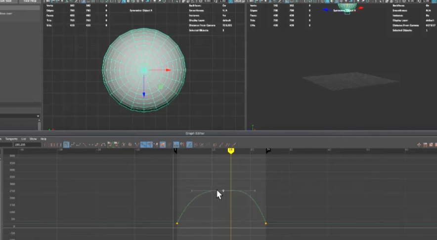
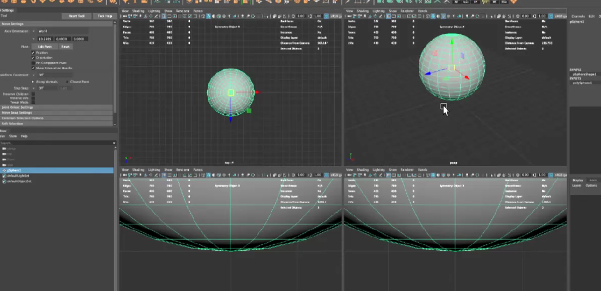
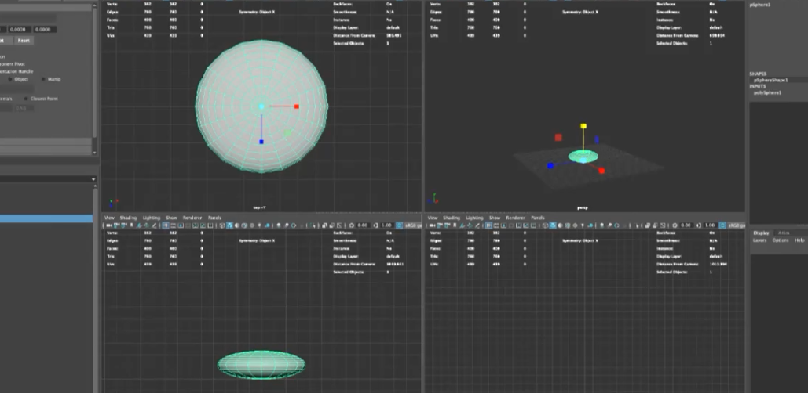

## Bouncing-Ball-Animation-Using-Maya
## Aim:
To make a bouncing ball animation using Maya.

## Procedure:
Step 1: Create a solid sphere and size it as required.

Step 2: Create a plane as a base for the ball to bounce.

Step 3: Place the ball in the initial position.

Step 4: Use Shift+W to start recording the positon of the for each frame.

Step 5: Set required number of frames in the time line chart.

Step 6: Open the time graph and adjust the y-axis so the bouncing ball animation looks smoother.

## Output:

## Result:
Therefore a bouncing ball animation is created using Maya.
